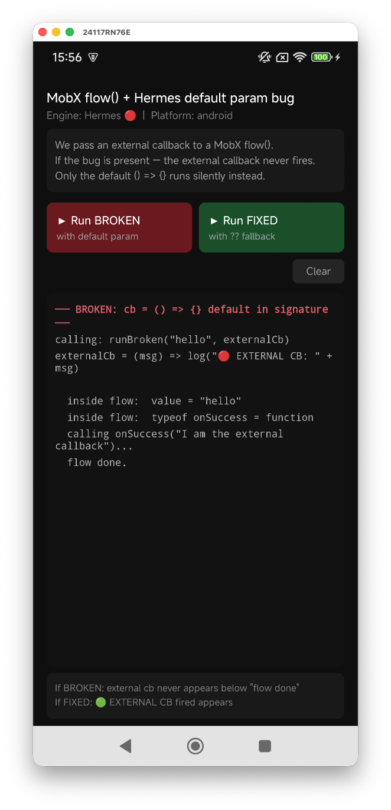
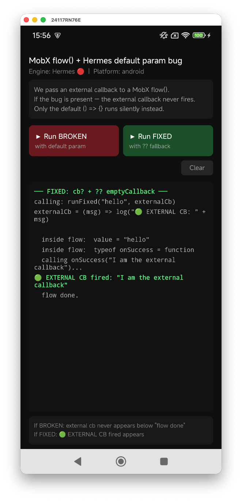

# Title

**Generator function with function-typed default parameter silently ignores the passed argument on Hermes (Babel `arguments`-based default param pattern)**

---

## Bug Description

When a generator function has a **function-typed default parameter** (e.g., `cb = () => {}`) and is called through MobX `flow()`, the externally passed callback is silently replaced by the default `() => {}` on Hermes. The bug does **not** reproduce with JSC.

The root cause is a Babel code generation pattern: `babel-preset-expo` (and `@babel/plugin-transform-parameters`) transforms generator functions with default parameters into a **regular wrapper function** that uses `arguments[1]` to detect whether a value was passed. On Hermes, `arguments` inside that wrapper is not correctly populated when the function is called through MobX's internal `.apply()` invocation — causing the check to fall through to the default value every time.

The bug is **silent**: `typeof cb` inside the generator still returns `"function"` (it is the default `() => {}`), so there are no errors or warnings — the wrong function simply runs instead.

- [x] I have run `gradle clean` and confirmed this bug does not occur with JSC
- [x] The issue is reproducible with the latest version of React Native.

**Hermes git revision:** `e0fc67142ec0763c6b6153ca2bf96df815539782` (hermes-2025-07-07-RNv0.81.0, bundled with RN 0.81.5)  
**React Native version:** 0.81.5  
**OS:** Android  
**Platform:** arm64-v8a (physical device, New Architecture enabled)

---

## Steps To Reproduce

1. Create a new Expo project with `expo-preset-expo` (SDK 54, New Architecture enabled, Hermes engine)
2. Install MobX: `npm install mobx mobx-react-lite`
3. Create a MobX store with a `flow()` generator that has a **function-typed default parameter** in its signature (see code example below)
4. Call the flow method passing an external callback
5. Observe that the external callback never fires — the default `() => {}` is used instead

**Code example:**

```typescript
import { flow, makeObservable, observable } from 'mobx'

const emptyCallback = () => {}

class TestStore {
    log: string[] = []

    constructor() {
        makeObservable(this, {
            log: observable,
            runBroken: flow,
            runFixed: flow,
        })
    }

    // ❌ BROKEN — function-typed default parameter in generator signature
    runBroken = flow(function* (
        this: TestStore,
        value: string,
        onSuccess: (msg: string) => void = () => {},
    ) {
        yield new Promise(resolve => setTimeout(resolve, 50))
        this.log.push(`typeof onSuccess = ${typeof onSuccess}`) // prints "function" — but it's the default!
        onSuccess('hello')                                       // fires the default () => {}, not the passed callback
    }).bind(this)

    // ✅ FIXED — optional param + nullish coalescing in body
    runFixed = flow(function* (
        this: TestStore,
        value: string,
        onSuccess?: (msg: string) => void,
    ) {
        onSuccess = onSuccess ?? emptyCallback
        yield new Promise(resolve => setTimeout(resolve, 50))
        this.log.push(`typeof onSuccess = ${typeof onSuccess}`)
        onSuccess('hello')                                       // correctly fires the passed callback
    }).bind(this)
}

const store = new TestStore()

// Both calls pass a real external callback:
store.runBroken('hello', (msg) => console.log('🔴 EXTERNAL CB fired:', msg))
store.runFixed('hello',  (msg) => console.log('🟢 EXTERNAL CB fired:', msg))
```

**Minimal reproduction repository:** https://github.com/[USERNAME]/hermes-mobx-flow-test

---

## The Expected Behavior

The externally passed callback should be called in both cases. On JSC/V8:

```
🔴 EXTERNAL CB fired: hello   ← fires correctly on JSC
🟢 EXTERNAL CB fired: hello   ← fires correctly on JSC
```

---

## The Actual Behavior (Hermes)

The `runBroken` callback silently uses the default `() => {}` and never calls the passed function.

**BROKEN** — `flow done.` appears but `🔴 EXTERNAL CB fired` is missing:



**FIXED** — `🟢 EXTERNAL CB fired: "I am the external callback"` appears correctly:



In text:

```
// runBroken output on Hermes:
typeof onSuccess = function   ← looks valid, but it's the default () => {}, not the passed callback
                              ← 🔴 EXTERNAL CB fired is MISSING — external callback never called

// runFixed output on Hermes:
typeof onSuccess = function
🟢 EXTERNAL CB fired: hello   ← correctly fires the external callback
```

---

## Root Cause Analysis

`babel-preset-expo` (Babel 7, `@babel/plugin-transform-parameters`) cannot place default parameters directly inside generator functions. It extracts them into a **regular wrapper function** that reads `arguments` to check whether a value was provided:

**What Babel generates for the BROKEN case:**

```javascript
// ⚠️ The function passed to flow() is a regular function, NOT a generator
flow(function(value) {
    var onSuccess = arguments.length > 1 && arguments[1] !== undefined
        ? arguments[1]    // ← relies on arguments[1] to detect the passed callback
        : function() {};  // ← falls back to the default
    return function*() {  // ← inner generator — IIFE, uses onSuccess from closure
        // ...
    }();
})
```

**What Babel generates for the FIXED case:**

```javascript
// ✅ Stays as a genuine generator function — no arguments-based detection
flow(function*(value, onSuccess) {
    onSuccess = onSuccess != null ? onSuccess : emptyCallback;
    // ...
})
```

You can verify this yourself by running:

```bash
node -e "
  const babel = require('@babel/core');
  const fs = require('fs');
  const result = babel.transformSync(fs.readFileSync('TestStore.ts', 'utf8'), {
    filename: 'TestStore.ts',
    presets: [require('./node_modules/expo/node_modules/babel-preset-expo')],
  });
  console.log(result.code);
"
```

**The Hermes-specific failure:** When MobX's `flow()` invokes the Babel-generated wrapper via `.apply(ctx, args)`, Hermes does not correctly populate `arguments` inside the wrapper function. `arguments.length > 1` evaluates to `false` (or `arguments[1]` is `undefined`), so the external callback is dropped and the default `() => {}` is used silently.

This only happens on Hermes — on JSC/V8, `arguments` is correctly populated and the passed callback is used as expected.

---

## Workaround

Avoid function-typed default parameters in generator functions wrapped by `flow()`. Use an optional parameter with a nullish coalescing assignment in the function body instead:

```typescript
// ❌ Broken on Hermes — triggers Babel's arguments-based default param pattern
runSomething = flow(function*(this: MyStore, onSuccess: () => void = () => {}) {
    // ...
})

// ✅ Safe on Hermes — Babel produces a genuine generator function
const emptyCallback = () => {}

runSomething = flow(function*(this: MyStore, onSuccess?: () => void) {
    onSuccess = onSuccess ?? emptyCallback
    // ...
})
```
